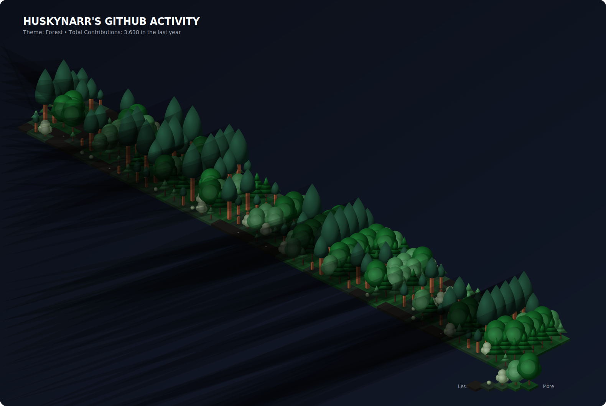
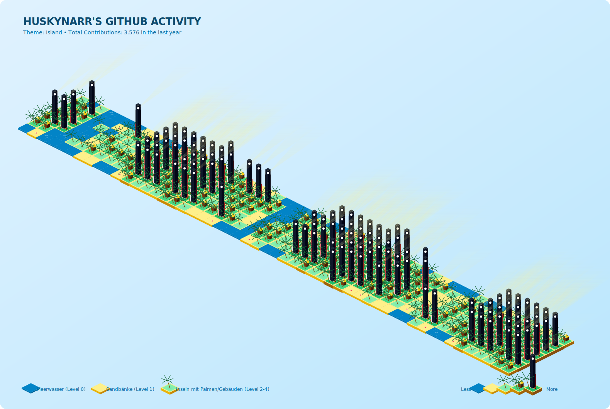
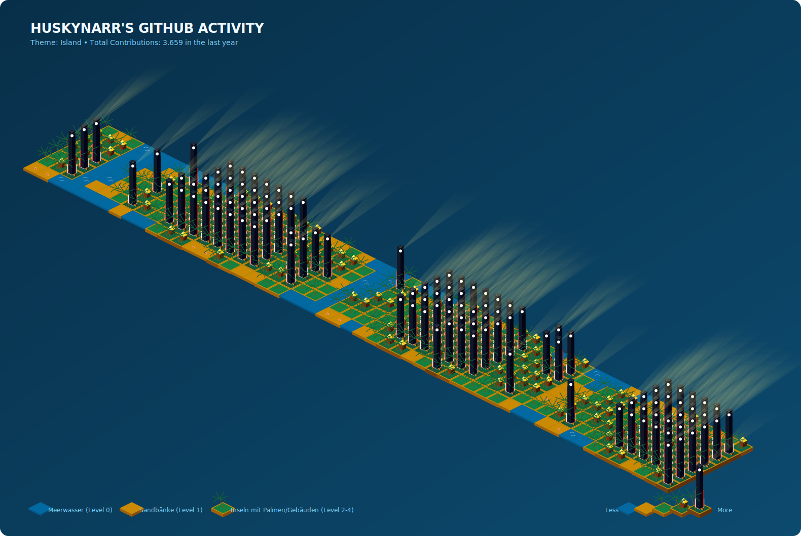

# 🚀 GitHub Activity 3D Visualizer

Ein kreatives Tool für deine **GitHub Profile Page**, das deine Git-Beiträge (Contributions) des letzten Jahres als atemberaubende, isometrische 3D-Vektorgrafik (SVG) darstellt. 

Statt der üblichen flachen 2D-Matrix oder standardmäßiger Balken übersetzt dieses Tool deine Aktivität in drei detailreiche, lebendige Szenerien, die sich stufenlos basierend auf deiner Commit-Anzahl verändern.

---

## 🎨 Die 3 Visualisierungs-Optionen (Themes)

Jedes Theme übersetzt die 53 Wochen (X-Achse, links-nach-rechts) und 7 Wochentage (Y-Achse, oben-nach-unten) in ein isometrisches Gitternetz.

### A) 🌲 Wiese & Wald (`forest`)
*Eine lebendige Lichtung mit Hell- und Dunkelmodus, deren Bäume sich je nach Art deiner Arbeit verändern.*
* **Hintergrund:** Kann über `-b light` (hell) oder `-b dark` (atmosphärisches Nacht-Layout) angepasst werden.
* **Baumarten nach Contribution-Typ:**
  - **Commits ($\sim$ 60%):** Spitze, isometrisch geschichtete Fichten/Nadelbäume.
  - **Pull Requests ($\sim$ 20%):** Gewaltige, hochgewachsene Mammutbäume (Sequoias) mit dicken roten Stämmen.
  - **Issues & Reviews ($\sim$ 20%):** Runde, buschige Laubbäume/Eichen mit weichem Blätterdach.
* **Level 0 (Keine Aktivität):** Sandig-trockener Waldboden mit kleinen Kieselsteinen.
* **Level 1-4:** Zunehmend dichter Mischwald, wobei die Bäume proportional zur exakten Beitragsanzahl stufenlos in die Höhe wachsen.

**Vorschau (Hell):**


**Vorschau (Dunkel / Nacht):**



### B) 🛣️ Straße & Autobahn (`highway`)
*Die gesamte Strecke ist als zusammenhängende 7-spurige Autobahn visualisiert, auf der der Verkehr deine Aktivitätsdichte widerspiegelt.*
* **Aufbau:** Keine Fugen mehr! Das gesamte Jahr bildet eine einzige, erhabene 3D-Autobahnplatte mit Leitplanken und Pfosten an den Rändern sowie gestrichelten Fahrbahntrennlinien zwischen den Spuren.
* **Level 0 (Keine Aktivität):** Eine leere Spur an dem jeweiligen Tag.
* **Level 1 (Geringe Aktivität):** Ein kleiner E-Scooter oder Motorrad mit Frontlicht auf der Spur.
* **Level 2 (Mittlere Aktivität):** Bunte Kompaktwagen in verschiedenen Farben mit leuchtenden Scheinwerfern.
* **Level 3 (Hohe Aktivität):** Große SUVs oder blaue Lieferwagen.
* **Level 4 (Sehr hohe Aktivität):** Riesige rote Sattelschlepper/Güter-LKWs mit silbernen Frachtcontainern.

**Vorschau:**


### C) 🌴 Das Insel-Archipel (`island`)
*Das Jahr wird als ein wunderschönes, ruhiges tropisches Ozean-Archipel dargestellt.*
* **Hintergrund:** Kann über `-b light` (heller, sonniger Tag über dem Meer) oder `-b dark` (atmosphärisches, tiefblaues Nachtmeer) angepasst werden.
* **Freiraum (Atemraum):** Level 0 Kacheln werden als flaches Ozeanwasser dargestellt. Da keine Gebäude in die Höhe ragen, entspannt sich das Auge an inaktiven Tagen.
* **Level 1 (Geringe Aktivität):** Eine winzige, flache Sandbank (z. B. mit einem kleinen roten Seestern).
* **Level 2 (Mittlere Aktivität):** Eine kleine Sandinsel mit einer Palme (Zufallswachstum je nach Beitragszahl).
* **Level 3 (Hohe Aktivität):** Eine tropische Insel mit zwei Palmen und einer kleinen gemütlichen Strandhütte.
* **Level 4 (Sehr hohe Aktivität):** Eine größere Insel mit einem rot-weißen Leuchtturm, dessen gelber Scheinwerferstrahl in den Himmel leuchtet, einer Schatztruhe und einer Palme.

**Vorschau (Hell / Tag):**


**Vorschau (Dunkel / Nacht):**



---

## 🛠️ Lokale Einrichtung & Testen

Da das Tool über ein intelligentes **Mock-Datensystem** verfügt, kannst du es lokal testen, ohne einen GitHub-Token einrichten zu müssen!

### 1. Installation
Stelle sicher, dass [Node.js](https://nodejs.org/) (Version 18+) installiert ist. Klicke auf die verlinkten Dateien, um sie im Editor zu betrachten.
```bash
# Repository klonen & Verzeichnis betreten
cd github-activity

# Abhängigkeiten installieren
npm install
```

### 2. TypeScript kompilieren
```bash
npm run build
```

### 3. SVGs generieren
Nutze das CLI, um deine Aktivität (oder Mock-Daten) zu rendern:
```bash
# Generiere das Wald-Theme
node dist/index.js -u Huskynarr -t forest -o test-forest.svg

# Generiere das Autobahn-Theme
node dist/index.js -u Huskynarr -t highway -o test-highway.svg

# Generiere das Insel-Theme
node dist/index.js -u Huskynarr -t island -o test-island.svg
```

Du kannst die erzeugten SVG-Dateien einfach per Doppelklick in deinem Webbrowser (Chrome, Firefox, Safari) öffnen, um das Ergebnis in voller Vektorauflösung zu bewundern!

---

## ⚙️ CLI-Optionen

| Flag | Langform | Beschreibung | Standard |
| :--- | :--- | :--- | :--- |
| `-u` | `--user` | **GitHub-Username** (erforderlich) | *keiner* |
| `-t` | `--theme` | Theme: `forest`, `highway`, `island` | `forest` |
| `-b` | `--bg` | Hintergrund-Modus: `light` oder `dark` | Theme-abhängig (`dark` bei Highway, sonst `light`) |
| `-o` | `--out` | Pfad für die Ausgabedatei | `github-activity-[theme].svg` |
| `-k` | `--token` | GitHub GraphQL API Token (oder via `.env` / Env-Var `GITHUB_TOKEN`) | *optional (nutzt sonst Mockdaten)* |
| `-h` | `--help` | Zeigt die Hilfe an | *N/A* |


---

## 🤖 GitHub Actions Integration (Autopilot)

Um deine echten Aktivitätsdaten automatisch jeden Tag zu aktualisieren, haben wir bereits einen fertigen Workflow für dich vorbereitet.

1. Erstelle ein GitHub-Repository für dein Profil (falls noch nicht geschehen, meistens mit dem Namen deines Usernames, z.B. `Huskynarr/Huskynarr`).
2. Pushe dieses Projekt (`github-activity`) in das Repository. Der Workflow liegt bereits unter [generate-activity-svg.yml](file:///.github/workflows/generate-activity-svg.yml).
3. GitHub Actions führt den Job automatisch täglich um Mitternacht aus und aktualisiert die SVGs. Du kannst ihn auch manuell im Tab **Actions** starten.
4. **Einbindung in dein README.md:**
   Füge einfach folgenden Markdown-Code in dein Profil-README ein:

```markdown
### 🌲 Mein GitHub Aktivitäts-Wald (Hell)


### 🌲 Mein GitHub Aktivitäts-Wald (Dunkel)


### 🛣️ Meine GitHub Aktivitäts-Autobahn


### 🌴 Mein GitHub Insel-Archipel (Hell)


### 🌴 Mein GitHub Insel-Archipel (Dunkel)

```
*(Hinweis: Diese Links funktionieren, sobald der erste Workflow erfolgreich auf GitHub durchgelaufen ist und die Dateien generiert wurden!)*

---

## 📂 Projektstruktur

- [src/index.ts](file:///home/huskynarr/github-activity/src/index.ts) — CLI Einstiegspunkt & Argumenten-Parser.
- [src/github.ts](file:///home/huskynarr/github-activity/src/github.ts) — GraphQL-API Integration & realistischer Mockdaten-Generator.
- [src/renderer.ts](file:///home/huskynarr/github-activity/src/renderer.ts) — Isometrische Render-Engine mit Theme-Spezifikationen und SVG-Komprimierung mittels Symbol-Wiederverwendung.
- [.github/workflows/generate-activity-svg.yml](file:///home/huskynarr/github-activity/.github/workflows/generate-activity-svg.yml) — GitHub Actions Workflow zur automatischen Generierung.
- [tsconfig.json](file:///home/huskynarr/github-activity/tsconfig.json) & [package.json](file:///home/huskynarr/github-activity/package.json) — Projektkonfigurationen.

---

## 🤝 Beitragen

Beiträge, Fehlerberichte und Feature-Wünsche sind herzlich willkommen! Schau gerne in die [CONTRIBUTING.md](file:///home/huskynarr/github-activity/CONTRIBUTING.md) für Details zum Entwicklungsprozess und Richtlinien für neue Themes.

## 📄 Lizenz

Dieses Projekt steht unter der **MIT-Lizenz** — Details findest du in der [LICENSE](file:///home/huskynarr/github-activity/LICENSE) Datei.
